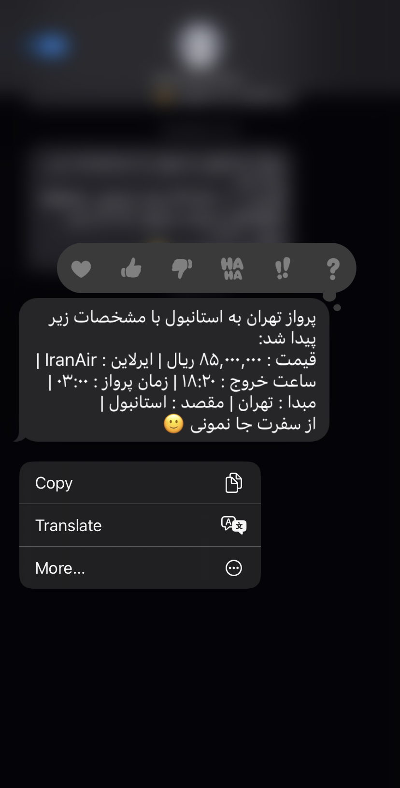
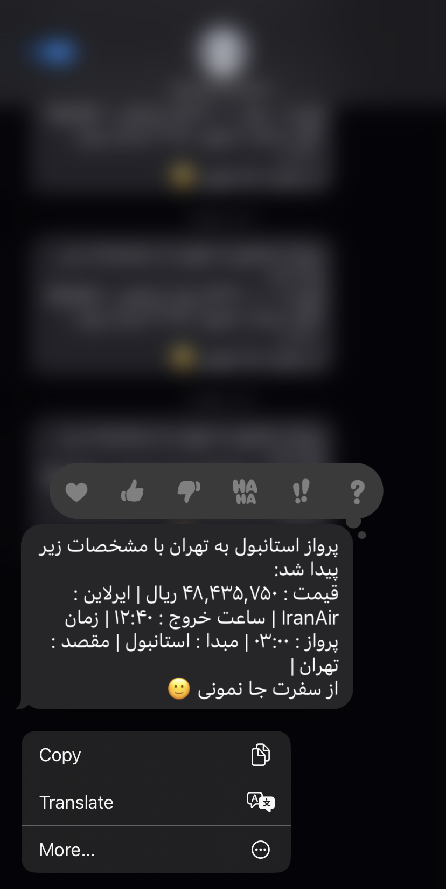

# TicketPriceSMS
### ابتدا کتابخانه های زیر را نصب کنید
``` pip install selenium ```  
``` pip install farsi_tools ``` \
``` pip install requests ```


 نکته: برای اجرای درست برنامه نیاز دارید chrome webdriver را [دانلود](https://chromedriver.chromium.org/downloads) کنید. دقت کنید نسخه مروگر کروم و **chrome webdriver** باید همگام باشند. فایل **117.0.5938.88  chrome webdriver** در فولدر **assets** نیز قرار داده شده است، اما بهتر است در زمان اجرا نسخه همگام با مرورگر را دانلود کنید.

---
 با فراخوانی متد **()get_info_from_alibaba**  و فرستادن **url1** به عنوان پارامتر می توانید اطلاعات ارزان ترین پرواز تهران به استانبول و با فرستادن **url2** می توانید اطلاعات ارزان ترین پرواز استانبول به تهران را را دریافت کنید. 
```
  get_info_from_alibaba(url1) # Tehran to Istanbul

  get_info_from_alibaba(url2) # Istanbul to Theran

```
 تابع **()send_sms** با استفاده از **API** سایت [ملی پیامک](https://www.melipayamak.com) می تواند برای شماره ای که به عنوان پارامتر به آن می دهید، پیامک ارسال کند.


```
  send_sms(sender = "50004001238183", receptor = شماره شما, text = sample_text)

```
---
چنانچه پیامک با موفقیت ارسال شود، متنی به شکل زیر در کنسول برنامه خود خواهید دید.
```
  {'recId': 3741437414, 'status': ' ارسال موفق بود ' }
```


 متغییر sample_text در واقع اطلاعات پرواز را با استفاده از کتابخانه **farsi_tools** به صورت خوانا سازمان می دهد.


    


